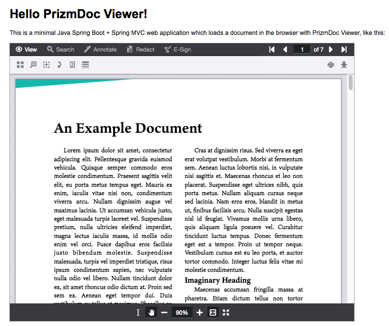

# Hello PrizmDoc Viewer with Java and HTML

A minimal Java Spring web application which integrates PrizmDoc Viewer.

## Pre-Requisites

- [JDK 18] or [JDK 11] or [JDK 8]
- [Maven] 3.0+

## Setup

### Configure the Application to Connect to PAS

Configure how to connect to PAS (PrizmDoc Application Services) by editing `src/main/resources/application.yml`.

#### Use PrizmDoc Cloud (Easiest)

If you're just getting started, the easiest thing to do is to use [PrizmDoc Cloud]. We host PAS for you and all you need is your [PrizmDoc Cloud](https://cloud.accusoft.com) API key. If you don't have an API key, you can get one for free at https://cloud.accusoft.com.

For [PrizmDoc Cloud], your `application.yml` will need to contain:

```yml
prizmdoc:
  pas:
    baseUrl: https://api.accusoft.com/prizmdoc/
  cloud:
    apiKey: YOUR_API_KEY
```

Where `YOUR_API_KEY` is your [PrizmDoc Cloud](https://cloud.accusoft.com) API key.

#### Host PAS Yourself (Advanced)

If you are self-hosting your own PAS instance, your `application.yml` contents will be slightly different:

```yml
prizmdoc:
  pas:
    baseUrl: YOUR_PAS_BASE_URL
    secretKey: YOUR_PAS_SECRET_KEY
```

`prizmdoc.pas.baseUrl` should be the base URL for requests to your PAS instance (like `"http://localhost:3000/"`).

`prizmdoc.pas.secretKey` must match the `secretKey` value specified in your PAS config file.

You will need to uncomment the "Self-Hosted PAS Configuration" section, and comment out the "PrizmDoc Cloud Configuration" section to enable the correct proxy configuration.

## Running the Sample

To start the application from the command line:

```
mvn spring-boot:run
```

This will launch a small web application on `http://localhost:8080`.

If you have configured your connection to PAS correctly, you should see output like this (some lines removed for clarity):

```
[INFO] Scanning for projects...
.
.
.

  .   ____          _            __ _ _
 /\\ / ___'_ __ _ _(_)_ __  __ _ \ \ \ \
( ( )\___ | '_ | '_| | '_ \/ _` | \ \ \ \
 \\/  ___)| |_)| | | | | || (_| |  ) ) ) )
  '  |____| .__|_| |_|_| |_\__, | / / / /
 =========|_|==============|___/=/_/_/_/
 :: Spring Boot ::        (v2.1.3.RELEASE)

.
.
.
2019-03-05 14:05:31.608  INFO 86300 --- [  restartedMain] o.s.b.w.embedded.tomcat.TomcatWebServer  : Tomcat initialized with port(s): 8080 (http)
2019-03-05 14:05:31.634  INFO 86300 --- [  restartedMain] o.apache.catalina.core.StandardService   : Starting service [Tomcat]
2019-03-05 14:05:31.634  INFO 86300 --- [  restartedMain] org.apache.catalina.core.StandardEngine  : Starting Servlet engine: [Apache Tomcat/9.0.16]
2019-03-05 14:05:31.728  INFO 86300 --- [  restartedMain] o.a.c.c.C.[Tomcat].[localhost].[/]       : Initializing Spring embedded WebApplicationContext
2019-03-05 14:05:31.728  INFO 86300 --- [  restartedMain] o.s.web.context.ContextLoader            : Root WebApplicationContext: initialization completed in 1827 ms
.
.
.
2019-03-05 14:05:33.929  INFO 86300 --- [  restartedMain] o.s.b.w.embedded.tomcat.TomcatWebServer  : Tomcat started on port(s): 8080 (http) with context path ''
2019-03-05 14:05:33.931  INFO 86300 --- [  restartedMain] sample.Application                       : Started Application in 4.798 seconds (JVM running for 5.222)
```

When you visit `http://localhost:8080`, you should see a viewer with an example document, like this:



[JDK 18]: https://adoptium.net/temurin/releases/?version=18
[JDK 11]: https://adoptopenjdk.net/releases.html?variant=openjdk11&jvmVariant=hotspot
[JDK 8]: https://adoptopenjdk.net/releases.html?variant=openjdk8&jvmVariant=hotspot
[Maven]: https://maven.apache.org/index.html
[PrizmDoc Cloud]: https://cloud.accusoft.com
